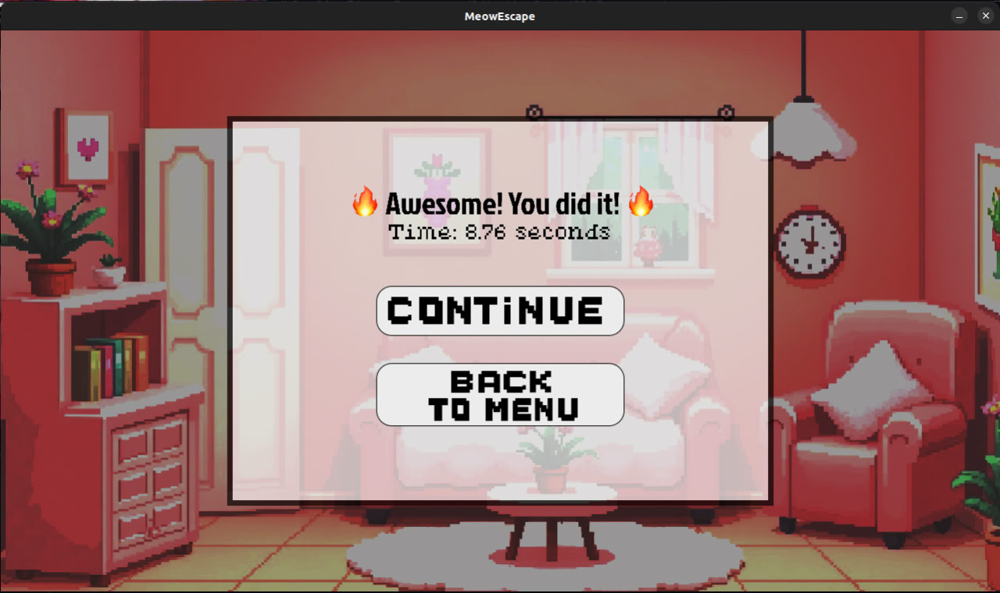
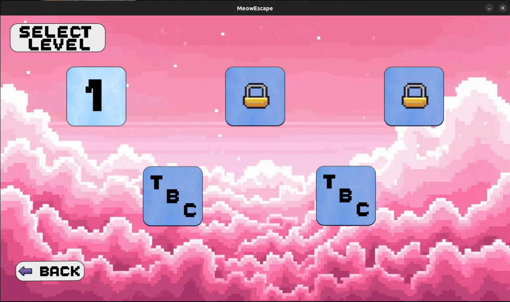
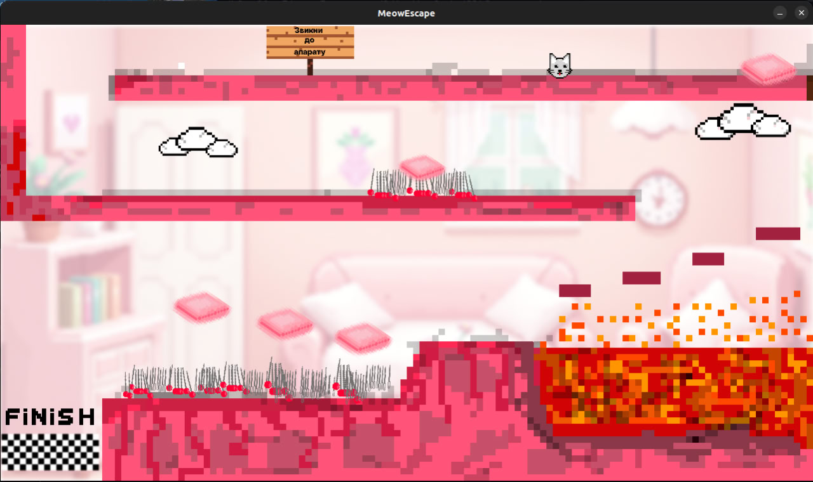
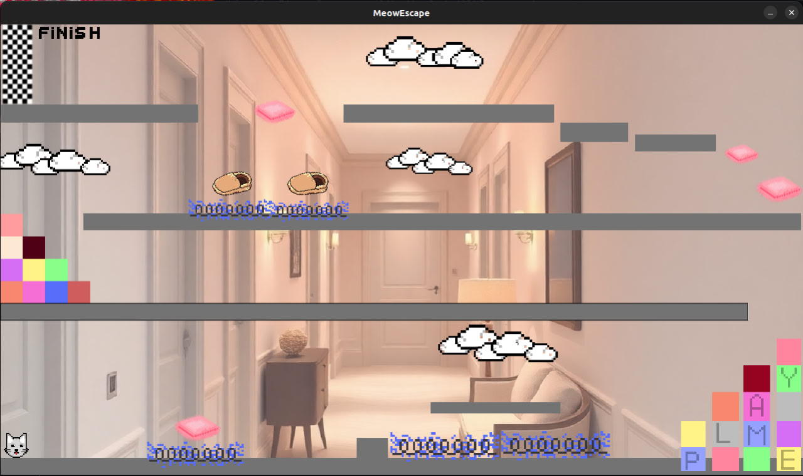
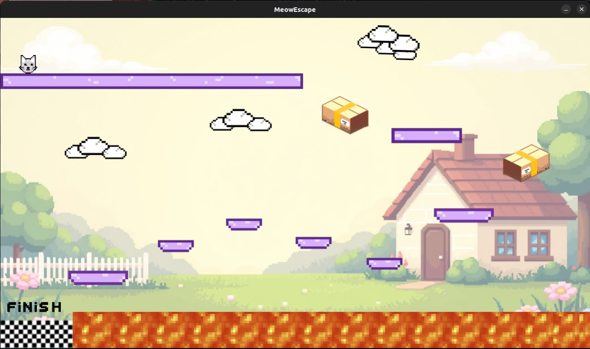
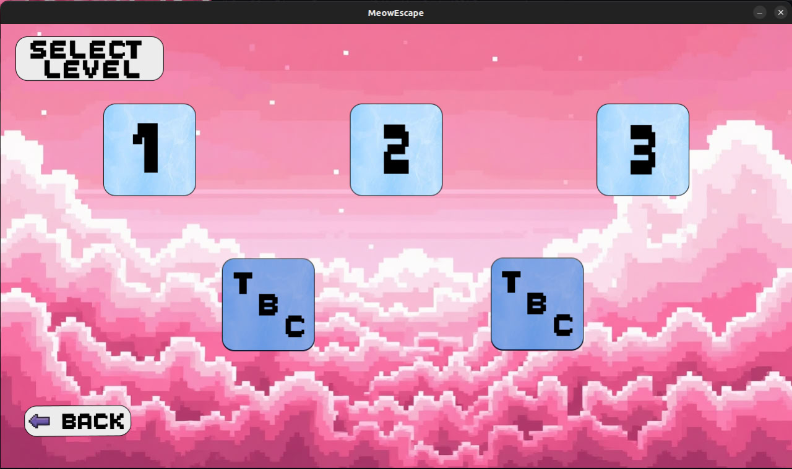
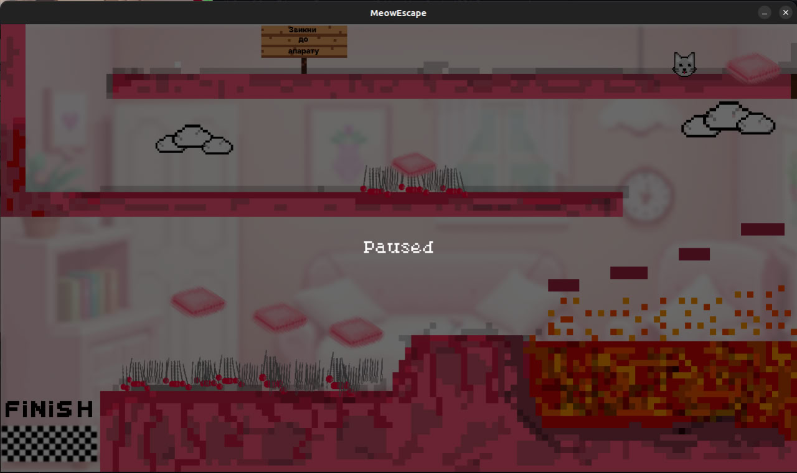
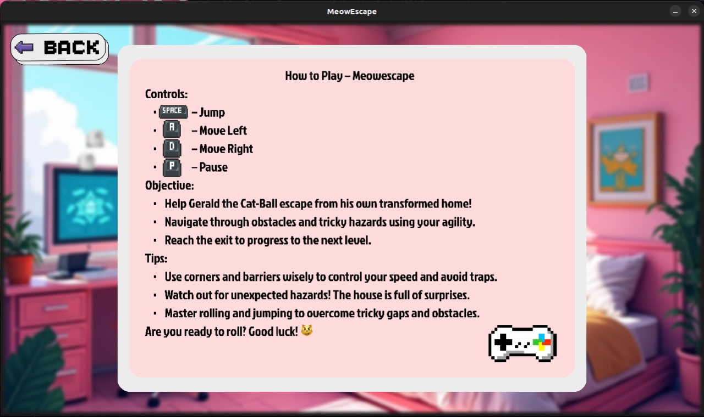
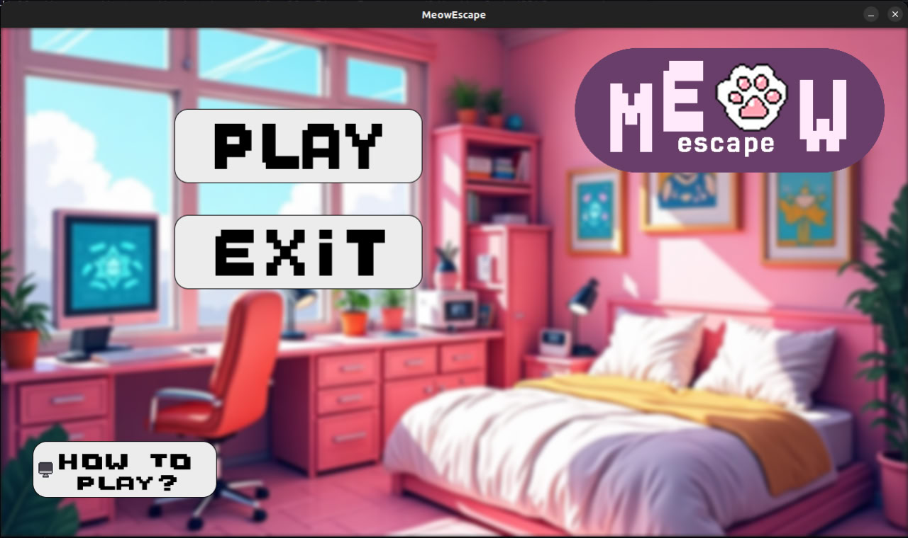

# Innovation Campus Endgame | MeowEscape

## About the Project
This is the final team project for the Innovation Campus Marathon. We had 7 days to complete it. The game was developed using **C** and the **SDL2** library.

## Authors
- [Artem Lotikov] [GitHub](https://github.com/Undeadick)
- [Matvei Antipov] [GitHub](https://github.com/Matvei-Antipov)
- [Daniil Latyshev] [GitHub](https://github.com/latyshevdaniil)
- [Egor Ermilov] [GitHub](https://github.com/C1aid)
- [Anastasia Vlasenko] [GitHub](https://github.com/asyavlasenko)
- [Sofiia Khyzhnychenko] [GitHub](https://github.com/soffffises)

## Game Description
Welcome to **MeowEscape**! In this exciting game, you control a small cat-ball searching for an escape from its house to return to its normal form. Your goal is to complete all levels without falling into traps!

### Game Objective:
- 🐾 Help Gerald, the cat-ball, escape from his transformed home!
- 🚧 Overcome obstacles and use your surroundings to your advantage.
- 🚪 Reach the exit to advance to the next level.

### Controls:
- **Space** - Jump
- **A** - Move left
- **D** - Move right
- **P** - Pause

## Installation
1. Clone the repository:
   ```sh
   git clone https://github.com/Undeadick/Innovation-Campus-Endgame.git
   cd Innovation-Campus-Endgame
   ```
2. Compile the project:
   ```sh
   make all
   ```
3. Run the game:
   ```sh
   ./endgame
   ```

## Screenshots
Here are some in-game screenshots:











